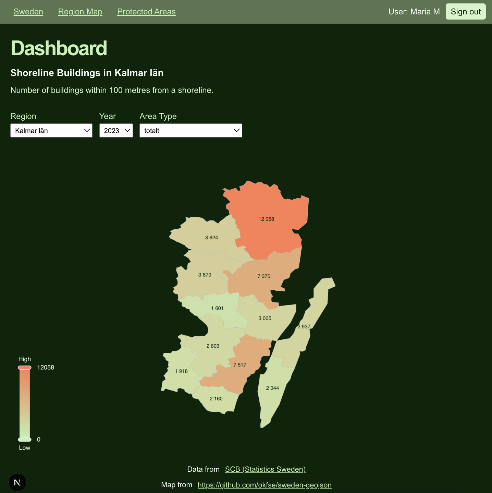

# Shoreline buildings in Sweden 🌊🏡

This application exposes an API to query for data about shoreline buildings in Sweden.

It also has a client application that shows some of the data from the API on a dashboard.

## Demo
### Video
Watch a demo of the application: [Demo of the Shoreline Buildings application (Youtube, 1:20 min)](https://youtu.be/GV7vf3J9VeY)

### Screenshots
  

## Usage
To use the dashboard, visit [https://cu3156.camp.lnu.se/](https://cu3156.camp.lnu.se/) and log in with Google.

To use the API, use the production URL: [https://cu3156.camp.lnu.se/api/graphql](https://cu3156.camp.lnu.se/api/graphql)

API documentation: [https://cu3156.camp.lnu.se/api](https://cu3156.camp.lnu.se/api)

Test documentation: [https://documenter.getpostman.com/view/39898331/2sBXigNZNU](https://documenter.getpostman.com/view/39898331/2sBXigNZNU) 

## Scope
> This application was developed as a school project for the course [1DV027](https://kursplan.lnu.se/kursplaner/kursplan-1DV027-1.000.pdf).

## Data source
Data used: [Byggnader i strandnära läge efter region och byggnadstyp. År 2018 - 2023](https://www.statistikdatabasen.scb.se/pxweb/sv/ssd/START__MI__MI0812__MI0812S/MI0812T01/) (Shoreline buildings by region and type of building. Year 2018 - 2023)  
Source: [Statistics Sweden](https://www.scb.se/en_/)

## Project structure
The application uses 
- a GraphQL API for the data resources with
  - a PostgreSQL database 
  - a Python seed
  - a Java / Spring Boot backend
- a REST API for authentication with
  - a MongoDB database
  - a Node.js/Express backend
- an interactive dashboard for data visualization with
  - React/Next.js
  - Apache ECharts
  - OAuth 2.0 / OpenID Connect with Google
- a CI/CD pipeline (Github Actions) with automated API tests (Postman/Newman)

## Usage
1. Fork the project.
2. Clone it to your computer.
3. `cd` into the project folder.
4. Run `cp .env.example .env` to rename *.env.example* into *.env .*
5. Edit *.env* and replace the default values with your credentials and settings.
6. Run `docker compose up -d` 

This will start all services. The seed script runs automatically, but will only populate the database if it does not contain data. 

## Technical information
The application was developed with and tested for Node version 24.1.0.
